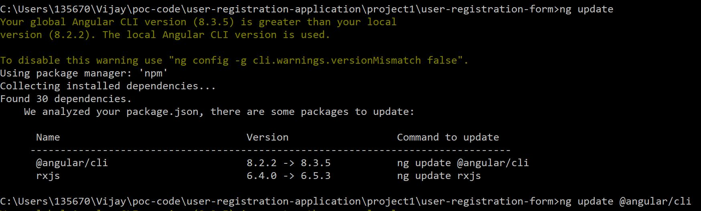

## Steps to upgrade to latest version of Angular.

* Execute command `ng update`. This analyze and list down the possible package upgrades and commands.
 
* Then, follow the each execution command advised. 
	* Like `ng update @angular/cli --allow-dirty`
	* Like `ng update rxjs --allow-dirty`

